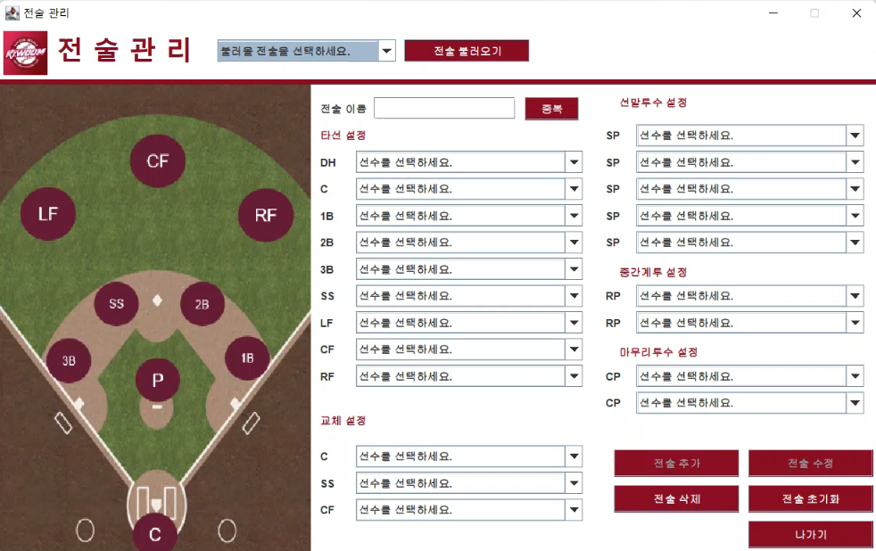

# Project_BaseballSquad | 야구 스쿼드 메이커

전공 JAVA 개인 프로젝트 입니다. 
📆 2022.03. ~ 2022.06.
 

## 📢 프로젝트 소개
 - 프로젝트 개발 배경 
   - JAVA 재학 중 Swing Component에 대하여 공부한 적이 있습니다.
   - Swing Component를 활용한 스쿼드 메이커를 구현하고자 이 프로젝트를 개발하게 되었습니다.
 - 기술 스택
   - 주요 언어: Java 8
   - 데이터베이스: MySQL, JDBC
   - GUI 개발: Swing Component
 - 기능과 특징
   - 사용자 인증 및 계정 관리: 사용자는 회원가입을 통하여 계정을 생성하고, 로그인하여 프로그램을 사용할 수 있습니다. (비회원 이용불가)
   - 선수 관리: 사용자는 선수의 정보를 등록하고 관리할 수 있습니다. 선수들의 이름, 포지션, 등의 정보를 입력하고 수정할 수 있습니다.
   - 스쿼드 관라: 사용자는 등록된 선수들로 알맞는 포지션의 스쿼드를 구성할 수 있습니다. 프로그램은 스쿼드에 필요한 정보를 간편하게 입력할 수 있도록 구성되어 있으며, 수정과 삭제를 할 수 있습니다.
   - 프로그램은 사용자가 등록한 선수와 전체적인 스쿼드를 한눈에 볼 수 있도록 시각화되어 있습니다.
 - 역할과 기여
   - 개인 프로젝트로 제작과 기획 및 모든 기능의 설계와 개발을 진행하였습니다.
 - 결과 및 성과
   - 프로젝트를 성공적으로 완료하였으며, 사용자들이 효율적으로 선수와 전술을 관리할 수 있는 자바 프로그램을 구현하였습니다.
 - 어려웠던 점과 극복 방법
   - Swing Component에 대하여 미흡하게 알고 시작되었던 프로젝트였지만, 제작과 구현을 통하여 Swing Component의 대한 쓰임과 이해를 높이는 경험이 되었습니다.
   - Swing Component에 대한 구현은 서재와 다양한 자료를 검색하여 이를 바탕으로 이해도를 높여 구현하게 되었습니다.
   - 데이터베이스의 설계와 처리는 수업시간에 배운 내용을 바탕으로 테이블과 컬럼을 설정하게 되었습니다.
 - 배운 점과 성장
   - 자바를 활용하여 처음 개발한 개인 프로젝트로써, 프로젝트의 전체적인 흐름을 파악할 수 있었습니다.
   - 또한, 데이터베이스와 인터페이스 구성에 대한 이해를 높일 수 있었습니다.

  
## ⚙️ 프로젝트 기능

### 📺 최초 화면 📺
실행 시 최초 화면입니다.

  

 

모든 사용자는 회원 가입을 통해 사용자 본인의 정보를 등록 후 이용이 가능하며,  
ID 또는 PW 를 분실했을 경우 ID 찾기 · PW 찾기 기능을 통해 분실된 ID와 PW 를 찾을 수 있습니다.   

로그인 관련 각 항목에 대한 자세한 설명은 다음 링크에서 확인 가능합니다.  
👉 <a href="https://github.com/wooksun/Project_BaseballSquad/blob/master/readme/Login.md" target="_blank">로그인 관련 설명 및 구동</a> 👈
 

### ⚾ 메인 ⚾
로그인 성공 시 메인으로 이동합니다.

  

 

KBO 10개 구단 중 한 팀인 '키움'이라는 팀로고와 선수 관리 · 전술 관리 · 끝내기 버튼으로 구성되어 있습니다.
 

### 🏃 선수 관리 🏃
선수 관리 화면입니다.

  

 

선수 관리에서 내가 원하는 선수의 정보를 입력하고 저장하여 관리할 수 있습니다.  
추가된 선수는 수정과 삭제가 가능합니다.  
 

선수 관리의 각 항목에 대한 자세한 설명은 다음 링크에서 확인 가능합니다.  
👉 <a href="https://github.com/wooksun/Project_BaseballSquad/blob/master/readme/Player.md" target="_blank">선수 관리 설명 및 구동</a> 👈
 

### ✨ 스쿼드 관리 ✨
스쿼드 관리 화면입니다.  

  

 
 
선수 관리에서 추가된 모든 선수는 각 포지션에 위치되도록 선택할 수 있습니다.

추가된 스쿼드는 상단의 전술 불러오기를 통해 정보를 불러올 수 있고, 수정과 삭제가 가능합니다.

전술 초기화 버튼을 통해 모든 항목을 초기화하여 아무것도 선택되지 않은 상태로 되돌릴 수 있습니다.

스쿼드 관리의 각 항목에 대한 자세한 설명은 다음 링크에서 확인 가능합니다.  
👉 <a href="https://github.com/wooksun/Project_BaseballSquad/blob/master/readme/Squad.md" target="_blank">스쿼드 관리 설명 및 구동</a> 👈
 
