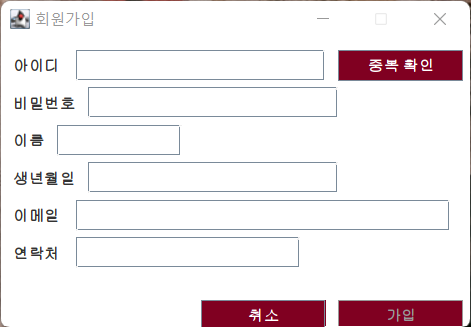
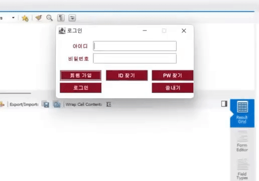
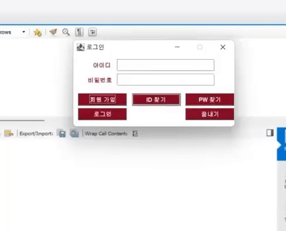
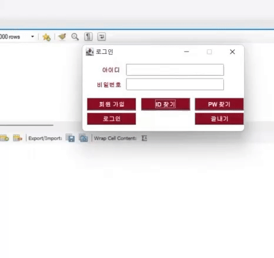
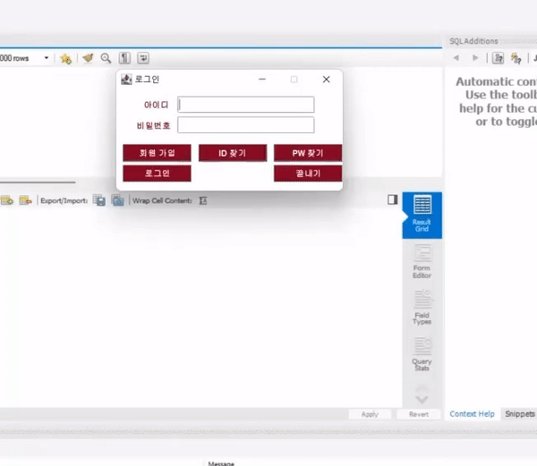

# Project_BaseballSquad | 야구 스쿼드 메이커 - 로그인 관련

로그인과 관련된 항목에 대한 설명 및 구동입니다. 

### 회원 가입

  

 

  

 

ID 중복 확인이 완료되면 ID 텍스트 박스와 중복 확인 버튼이 비활성화 되며,  
동시에 가입 버튼이 활성화됩니다.  

입력하지 않은 항목이 존재할 시 가입이 진행되지 않습니다.  
 

### ID 찾기

  

 

이름과 생년월일을 통해 분실된 ID 를 찾을 수 있습니다.  
 

### PW 찾기

  

 

ID와 연락처를 통해 분실된 PW 를 찾을 수 있습니다.  
 

### 로그인

  

 

사용자가 로그인에 성공하면 메인 화면이 출력됩니다.

