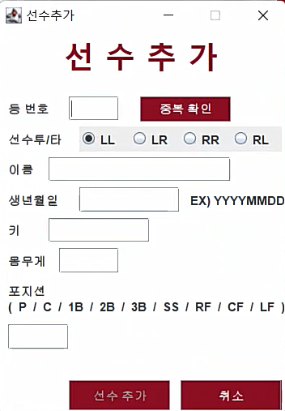
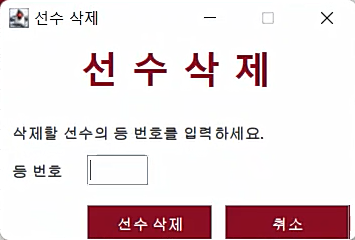
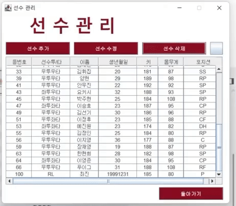

# Project_BaseballSquad | 야구 스쿼드 메이커 - 선수 관련

선수 관리와 관련된 항목에 대한 설명 및 구동입니다.  

### 선수 추가

  

 

  

 

등 번호에 중복 여부를 조건을 걸어 동일한 등 번호를 사용할 수 없도록 설정하였습니다.  

등 번호 중복 확인이 완료되면 등 번호 텍스트 박스와 중복 확인 버튼이 비활성화 되며,  
선수 추가 버튼이 활성화됩니다.  

각 항목에 대한 정보를 입력 후 선수를 추가할 수 있으며,  
비어있는 항목이 존재하면 선수를 추가할 수 없습니다.
 

### 선수 수정

  

 

  

 

수정할 선수의 등번호를 통해 존재할 경우 해당 선수의 정보를 불러오며,  
동시에 선수 수정 버튼이 활성화됩니다.  

등 번호를 제외한 모든 항목은 변경이 가능합니다.  
비어있는 항목이 존재하면 선수를 추가할 수 없습니다.
 

### 선수 삭제

  

 

  

 

등 번호를 통해 선수를 삭제할 수 있습니다.
 
