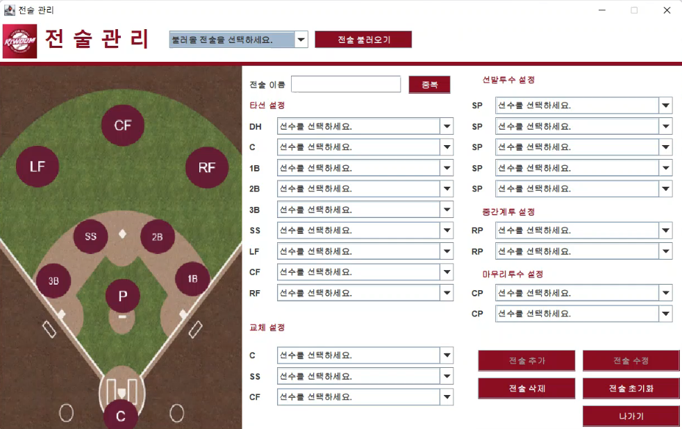
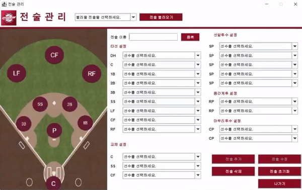
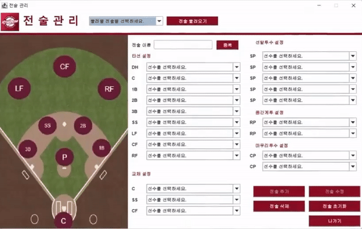
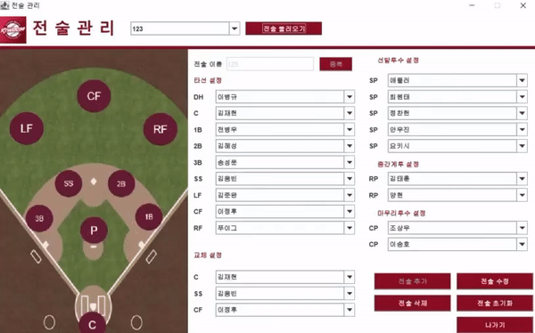
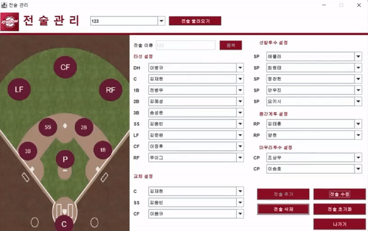

# Project_BaseballSquad | 야구 스쿼드 메이커 - 전술 관리 관련

전술 관리와 관련된 항목에 대한 설명 및 구동입니다.  

### 전술 추가

  

 
※ 영상 시간을 고려하여 타선 설정과 교체 설정은 미리 지정한 채로 영상을 녹화한 점 양해 부탁드립니다. ※

  

 

전술 이름은 중복체크를 통해 중복되지 않도록 설정했습니다.  

각 포지션에 해당되는 선수들을 설정하여 스쿼드를 저장하며, 콤보 박스를 클릭하여 변경이 가능합니다.  

한 전술에 동일한 선수 두 명을 할당할 수 없으며, 선수 관리에서 추가된 모든 선수는 전술의 각 포지션에 할당이 가능합니다.
전술 추가 시 입력되지 않은 항목이 존재하면 전술을 추가할 수 없습니다.  

### 전술 불러오기

  

 

상단의 콤보 박스에서 사용자가 추가한 전술 목록이 제공됩니다.  

불러올 전술을 선택 후 전술 불러오기 버튼을 클릭하면,  
모든 항목이 사용자가 선택한 전술의 데이터로 채워집니다.
 

### 전술 수정

  

 

전술 이름 외 모든 항목은 수정이 가능합니다.  

전술 추가와 마친가지로 한 전술에 동일한 선수 두 명을 할당할 수 없으며,  
전술 추가 시 입력되지 않은 항목이 존재하면 전술을 추가할 수 없습니다.  
 

### 전술 삭제

  

 

콤보 박스창을 띄워 삭제할 전술을 선택한 후, 삭제 버튼을 클릭하면 전술 정보가 모두 삭제됩니다.
 

### 전술 초기화

  

 

전술 관리의 모든 항목을 처음 상태로 되돌립니다.  
 
